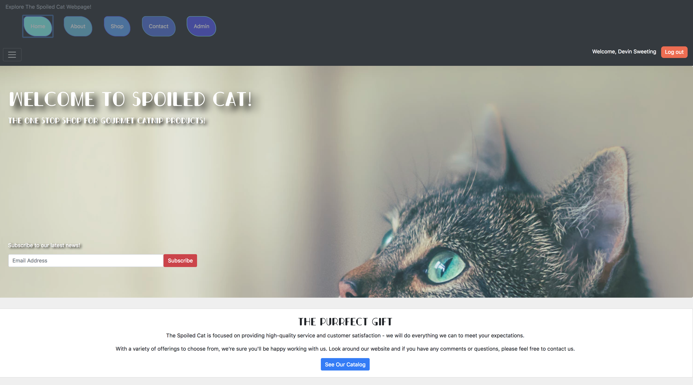

# The Spoiled Cat

#### This is a mock eccommerce store for the Local Portland Business "The Spoiled Cat".
### See deployed site at https://thespoiledcat-228.firebaseapp.com/

#### By Devin Sweeting

## Description

This project was generated with [Angular CLI](https://github.com/angular/angular-cli) version 1.6.5. The Business "The Spoiled Cat" is a local small business that operates at the Portland Saturday Market. To see the original site visit: "https://www.thespoiledcat.com/default.html"

## Setup/Installation Requirements

* This application was built on Webpack .....
* Clone this repository `https://github.com/devsweeting/Super-Galactic-Calculator.git`.
* Install dependencies: `$ npm install`
* To open mock-site you'll need your own firebase key:
  * Log-in to firebase and create an API-Key under 'authentication' and then click on "web set-up"
  * create this file in project `/src/app/api-keys.ts`
  * Use this syntax

   export const masterFirebaseConfig= { `insert copied Firebase api key thats between the same brackets here` }

* To view site run `ng serve` and go to localhost:4200 on your browser.

To download your own Firebase api key, visit:
Then insert the key into the src/app/api-key.ts folder

## Build

Run `ng build` to build the project. The build artifacts will be stored in the `dist/` directory. Use the `-prod` flag for a production build.

## Running unit tests

Run `ng test` to execute the unit tests via [Karma](https://karma-runner.github.io).

## Known Bugs

This app is still in production and you are bound to encounter bugs.

## Support and contact details

If you have any questions about this application please contact Devin Sweeting via email: devinsweeting@gmail.com

## Further help

To get more help on the Angular CLI use `ng help` or go check out the [Angular CLI README](https://github.com/angular/angular-cli/blob/master/README.md).

## Technologies Used

Webpack, Karma & Jasmine, ESlint, ES6 Javascript, Angular, Node.js.

### License

License: none

Copyright (c) 2018, Devin Sweeting

Permission is hereby granted, free of charge, to any person obtaining a copy of this software and associated documentation files (the "Software"), to deal in the Software without restriction, including without limitation the rights to use, copy, modify, merge, publish, distribute, sublicense, and/or sell copies of the Software, and to permit persons to whom the Software is furnished to do so, subject to the following conditions:

The above copyright notice and this permission notice shall be included in all copies or substantial portions of the Software.

THE SOFTWARE IS PROVIDED "AS IS", WITHOUT WARRANTY OF ANY KIND, EXPRESS OR IMPLIED, INCLUDING BUT NOT LIMITED TO THE WARRANTIES OF MERCHANTABILITY, FITNESS FOR A PARTICULAR PURPOSE AND NONINFRINGEMENT. IN NO EVENT SHALL THE AUTHORS OR COPYRIGHT HOLDERS BE LIABLE FOR ANY CLAIM, DAMAGES OR OTHER LIABILITY, WHETHER IN AN ACTION OF CONTRACT, TORT OR OTHERWISE, ARISING FROM, OUT OF OR IN CONNECTION WITH THE SOFTWARE OR THE USE OR OTHER DEALINGS IN THE SOFTWARE.

Copyright (c) 2018 Devin Sweeting
